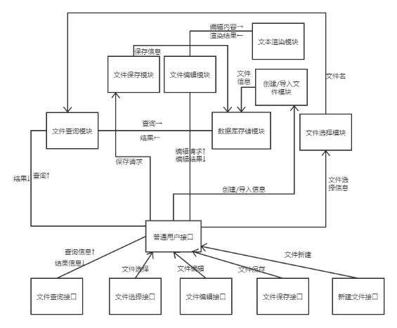
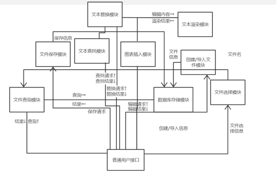
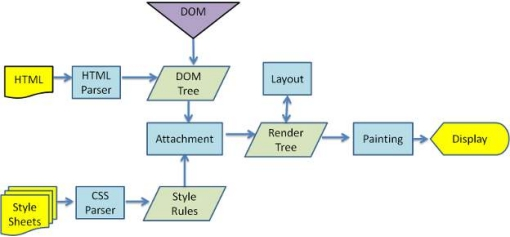
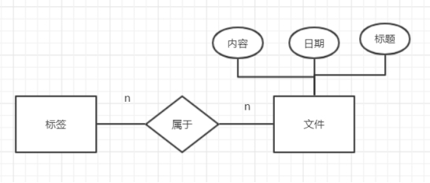

# 设计文档

## **软件体系结构设计（概要设计）：**

​	我们将使用模块结构图（module structure diagram）来描述软件体系结构。模块结构图主要包含模块和模块间调用这两个概念，分别对应软件体系结构中的构件和连接子。

在分析文档中，我们已经给出了项目的DFD图，虽然可以利用课件及教材中介绍的从DFD到MSD的映射方法，将DFD图机械地转换成MSD，但本小组不满足于仅使用这种机械的转换，而希望从一种更为宏观的视角出发，去建立和定义软件体系结构，完成概要设计。

​	我们首先考虑，从基本的文件编辑出发，用户是如何使用系统的。普通用户能够创建/导入文件、查询文件、选择文件、编辑文件和保存文件。为了与系统进行上述交互，我们为普通用户设计了一个接口来实现人机交互，比如叫做“普通用户接口”。这个接口能够允许用户创建/导入文件、查询文件、选择文件、编辑文件和保存文件。接收到上述请求后，接口将这些请求分别转发给相应的模块处理，例如，“文件查询”请求交给“文件查询”模块进行处理，“文件选择请求”交给“文件选择”模块进行处理，以此类推。用户通过文件查询模块，查询模块再调用数据库存储模块，即可返回查询结果。用户调用文件保存模块，保存模块将保存信息传入数据库存储模块，即可存储文件。用户调用创建/导入文件模块，创建/导入模块将文件信息传入数据库存储模块，即可完成新建文件操作。用户调用文件编辑模块，编辑模块将编辑内容传给渲染模块，渲染操作封装在渲染模块中，返回渲染结果，再将编辑结果返回给用户。用户调用文件选择模块，选择模块将文件名传给查询模块，由查询模块调用数据库存储模块，最终完成选择操作。这里，我们将文本的渲染功能封装在文本渲染模块中，将文件的新建、导入、查询以及最终的保存等相关操作的内容封装在数据库存储模块中。

最终，我们建立了如下图所示的初始MSD图。

 

<h5 align="center">
    图1	初始MSD图
</h5>

### **进一步优化：**

在若干需要优化的地方，这主要体现在以下两点：

（1）一些模块可能过细，可以将功能上相近或相关的模块合并；

（2）一些模块可能粒度过粗，还可以继续分解。我们对MSD进行优化的总体原则是"高内聚、低耦合"原则。例如：①在上图中，我们实际上建立了几个模块（5个模块）用来表示用户接口（即普通用户接口--作为总控模块、文件查询接口、文件选择接口、文件编辑接口、文件保存接口和新建文件接口）。这几个模块主要是界面、UI，具有一定的内聚性。因此在体系结构设计过程中，我们将它们合并为一个普通用户接口。②上图中的编辑模块可能粒度过粗，可以进一步将其划分成若干子功能模块，其中包含查找、替换、插入图表等。

 

<h5 align="center">
    图2	进一步改进后的MSD图
</h5>

## 详细设计：

### 文本渲染模块：

使用markdown-it包对文本进行处理，生成html内容，用ejs.render将头部、渲染后的文本内容和尾部组合起来形成最终展示的html。 

 

### 文本编辑模块：

构建MenuItem并用Menu.buildFromTemplate生成对应的菜单，对于撤销、重做、剪切、复制、粘贴、删除、全选等操作，用生成MenuItem时的可选参数role来实现，role对应的值为undo, redo, cut, copy, paste, delete, selectAll等。对于支持正则表达式的查询等功能需要单独实现。

 

 

### 文件存储模块：

使用sqlite作为简易数据库存储数据。一个文件可以属于多种标签，每个标签下可以有多个文件。如下为er图。

 

 

  

### 文件查询模块：

 

 

 