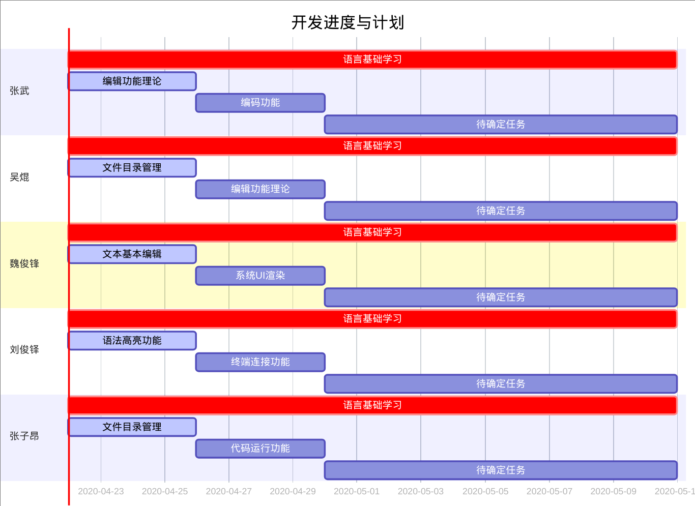

## 前言

Electron 开发桌面应用使用的是 JavaScript, HTML 和 CSS 来构建跨平台应用。

在这之前，桌面应用往往是使用 QT（C++)、C# 或者 Java 的 Swing 框架来构建的。这些技术内容属于常规意义上的后端层面。

而 Electron 开发所涉及的内容其实是典型的前端技术栈。

作为一种前端技术，所从事的却是桌面级应用，这种反差感某种程度上令人神往。

另一方面，当我们不经意间发现我们所经常接触的应用如 Visual Studio Code、Hyper、Github Desktop 等不约而同地采用了 Electron 之时，我们很难抑制住这份期望一探究竟的心情。

然而，在展望之前，需要清晰的，是立足的土地。事实上，几年来我们所学习的基本上清一色的是后端层面的语言、技术。即便有所了解，熟练度也并不乐观。

于是我们所面对的是前端三杰、前端俯冲后端的 node.js 以及 Electron 框架。

不过，课设的过程本身就是学习的过程。既然是学习总是要需要接触新的东西。类图建模，虽然是熟悉的 Java，但原理以及方案是全新的；员工考勤，业务分明、技术栈基本了然，然而广度之下，亲切之外仍有众多未涉足的领域。

但即便如此，基于 Electron 的跨平台代码编辑器作为一个全新的领域定然需要 all in 的姿态去面对。

---

## 项目基本分析

因为并非一个老练的 front-end developer，项目的分工以及开发计划迟迟难以度量。

虽然经过了初步的浏览，对于项目有了一定的基本认识，但目前视野仍旧不能支持自顶向下的宏观布局。于是软件工程学意义上的瀑布模型或需求明确的快速原型模式难以被采用。

相形之下，视软件为一系列增量构建的增量模型或许较为合适。

代码编辑器作为我们所日常接触的软件，其功能构建是足够明确，且深有体会的。

**剖析其基本功能，可大体划分为：**

-   文本基本编辑功能部件
-   文件目录管理功能部件
-   文本编码功能部件
-   语法高亮功能部件
-   终端连接功能部件
-   代码运行功能部件
-   系统 UI 渲染

构建纵向存在延伸：每一个功能存在有更深一层次增量构建，譬如文本编辑功能部件在基本的编辑之外添加撤销重做、全局替换等功能；目录管理功能在能正常启用同操作系统文件管理器的联通显示之外还应有目录级别的查询功能等。但因整体复杂性，此处并未标明，有待补充。

构建横向存在独立性：依据为功能之间的并非全然依赖。虽然文本基本编辑功能同文本目录功能可以称为文件管理的一体两面，但前者针对于单个文本进行操作而后者主要要同操作系统文件管理器进行协同。两者间仍存在一定独立性。

此外，不同的功能部件，其涉及的理论知识是不同的。虽然增量构建的流程上存在一定的关联，但理论知识的补充其实是可以并行进行的。

---

## 分工以及开发计划 V0.1.0

以上是基本的调研结果，分工以及开发计划以甘特图的形式呈现。**因为并非最终版本，所以时间线以及内容上比较粗粒度。**初版如下：

由于项目需要花费大量时间成本进行学习，故大体上将开发计划分为两个阶段，第一个阶段为8-13周**语言基础学习**，第二个阶段为14-16周的**项目开发实践**。此计划更新**迭代周期**预计为两周一次。

9-13周

14-16周

此后将每两周更新大致任务完成情况及进一步开发计划安排

第11周

9-10周在完成项目分工及开发计划、系统原型和需求文档基础上，进行了对electron框架的学习，以及electron框架的初步搭建。

第13周

11-12周在完成系统分析文档、系统设计文档基础上，在菜鸟教程、w3school等平台进行了electron框架下HTML、CSS、JS语言的学习，以及跟项目相关资料的搜集和整理。

第15周

9-13周大致完成了语言基础的学习，14-16将展开项目功能的实际开发。第十四周小组成员在各自任务上进行了初步探索，但严格意义上并没有完全实现任务，故在接下来两周任务量较大。

