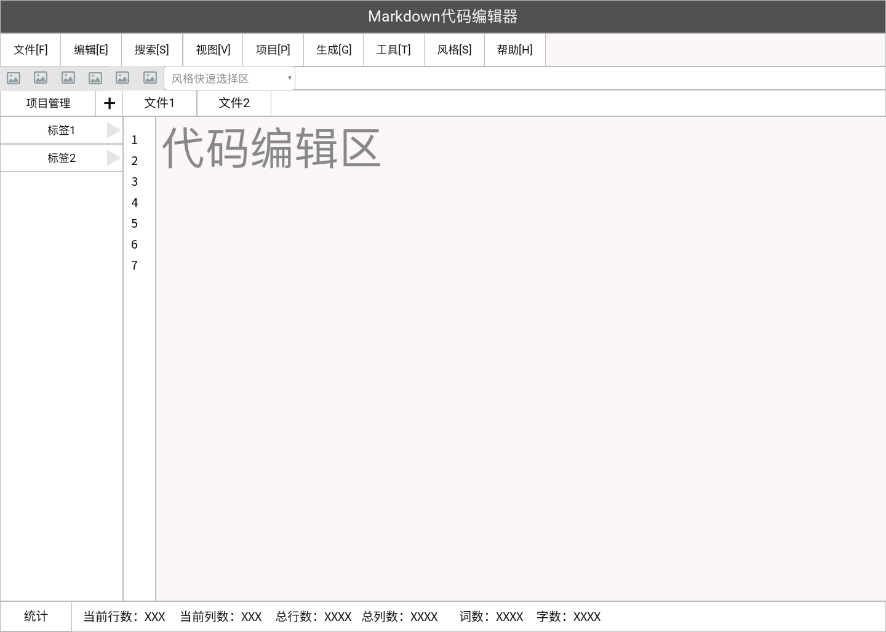
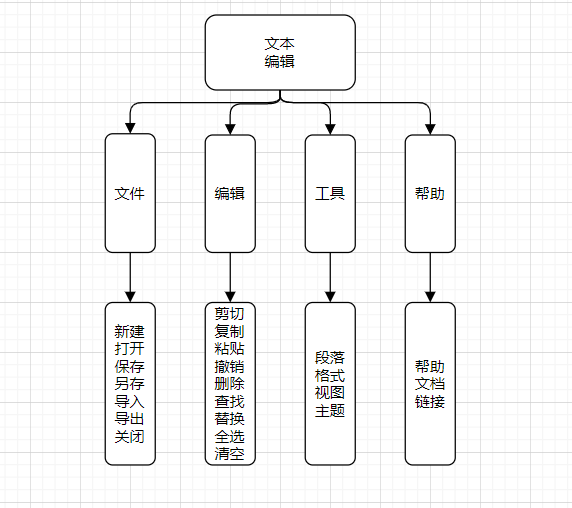
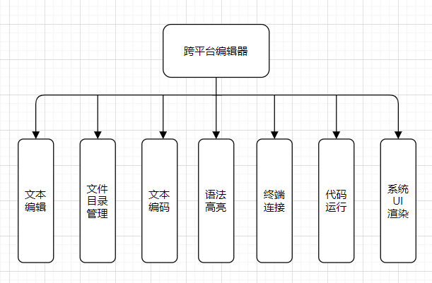

# 1.范围

## 1.1 系统陈述

该项目为软件工程课程设计作业，定位为一般开发人员真正可用的跨平台的方便快捷编辑器。

## 1.2 文档概述

项目供小组成员开发学习，增长专业见识，提高专业水平，暂无任何商业用途。

# 2.需求

## 2.1 状态说明

-   入口状态

    Ø 新开文本编辑器时，提供初始化页面引导功能

-   文本编辑状态

    Ø 未保存状态：文本编辑处于未保存状态；在此之上可有自动保存功能

    Ø 已保存状态：计划已保存，可添加删除可提交

-   代码 Debug 状态

    Ø 调试状态下将启用断点调试功能

## 2.2 需求陈述

### 2.2.1 目标

我们致力于做出一款支持跨平台、满足基本的文本编辑功能的编辑器， 除此之外最少支持一门主流编程语言或标记语言的高亮提示和智能提示，支持不同编码的文本文件，尽可能实现在编辑器中使用终端和支持编译运行代码。力争使产品便捷好用、功能强大，做到可以真正投入使用而并非仅仅作为课设作业提交。

### 2.2.2 运行环境

-   运行环境：

    node.js

-   运行平台：

    该编辑器支持 windows 和 linux、mac 等多个平台

### 2.2.3 用户特点

​ 用户定位为有着普通文本编辑需求以及基本开发需求的人员。

### 2.2.4 关键点

-   代码编辑器本身应该支持不同的语言对象，不过在开发初期，最好还是专注于一门语言对象。markdown 编辑器相对而言功能涉及全面，除却无法编译运行外，其所涉及的文件管理、代码高亮等内容已经覆盖了大部分编程语言所需要的内容。

    #### 文本编辑：

    #### 选取功能

    首先我们需要让一个 `div` 成为可编辑状态，加入`contenteditable="true"` 属性即可。

    在编辑区域，启用编辑状态之外，一个重点是光标的操作。

    我们可以使用浏览器提供的 `selection` 对象和 `range` 对象来操作光标。

    Selection 对象表示用户选择的文本范围或插入符号的当前位置。它代表页面中的文本选区，可能横跨多个元素。文本选区由用户拖拽鼠标经过文字而产生。selection 对象获得的 range 对象是我们操作光标的重点。

    #### 保存

    代码编辑的结果是生成一个个保存代码用的文件，而这些文件的内容是我们所需要记录的，此外一些配置文件同样是需要记录保存以供多次使用的。管理这些内容的部件可以视作底层模型。文件为内容的管理可以使用过数据库来驱动，启用轻量级的数据库来专门存储保存。

    #### markdown 渲染

    对于 markdown 文件而言，代码编辑之外需要额外的渲染。思路是定义渲染对象来对应的.md 文件渲染成.html 文件。而在 electron 上，electron 的进程因为分为两种，一种是主进程，一种是渲染进程。编辑器的内容，将实时由 `ipcRenderer.send` 下发出去，即由 Main 进程的 `ipcMain.on` 事件获取，渲染进程向主进程发送事件主进程监听到事件后，创建新的窗口，并导入生成的 html 文件，加以展示。

    #### 用户界面

    用户界面设计，出于第一次迭代的原因的考虑，只列出了必要的操作对象，并通过直接展示而不是下拉菜单的方式更加直截地测试各种功能。

    我们将页面布局分成四个部分，顶层按钮区，左侧目录区，右侧文本编辑区， 下侧底部信息区。

    其中:

    -   顶层按钮区主要提供能由鼠标直接点击的操作。包括新建标签，删除标签，保存，导出等。

    -   目录区展示项目的文件解构。

    -   文本编辑区内可以进行编辑，同时还有标签的存在

    -   底部信息区主要提供的是词数、行数、字数等可能的统计信息。

    

**存储**：标签和 markdown 文件存储在固定位置，不对工作区域进行选择。（考虑建立数据库。只通过软件访问 md 文件。想要获得 md 文件时可以使用导出功能）

**文件**：展开的选项为新建标签、新建 markdown（两者皆需要在新建时命名，名字在同级重复时有错误提示。新建 markdown 会在当前选择的标签下新建）、保存、导出为其他格式

**编辑**：展开的选项为撤销、重做、剪切、复制、粘贴、全选、查找、替换

**风格**：选择一种 markdown 生成的样式

**文件结构**：Markdown 编辑器如何满足老师给出的“项目管理”需求？（代替方案：可以新建不同标签用于分类，标签下可以新建 markdown 文件）

**编辑区**：高亮显示（如连接引用、代码块用特殊颜色显示）、代码补全（成对出现的符号的自动补全，如括号；或是对代码块内不同语言的补全）、编辑区内容可以自动保存

**统计**：显示词数、行数、字数

**其他**：支持不同编码（这个没有了解）、支持 linux 和 window

### 2.2.5 约束条件

时间：项目要求在八周之内包括各种文档以及项目本身全部完成

经费：无科研经费

技术：掌握知识有限

## 2.3 需求规格

### 2.3.1 软件系统总体功能/对象结构

此处需要对**总体**功能/对象结构进行描述，包括**结构图、流程图、或对象图。**

**从总体上剖析其基本功能，可大体划分为：**

-   文本基本编辑功能部件
-   文件目录管理功能部件
-   文本编码功能部件
-   语法高亮功能部件
-   终端连接功能部件
-   代码运行功能部件
-   系统 UI 渲染

### 2.3.2 软件子系统功能/对象结构

此处需要对**主要**子系统中的基本功能模块/对象结构进行描述，包括**结构图、流程图、或对象图**。

##### 文本编辑的主要结构

##### 编辑器功能需求

