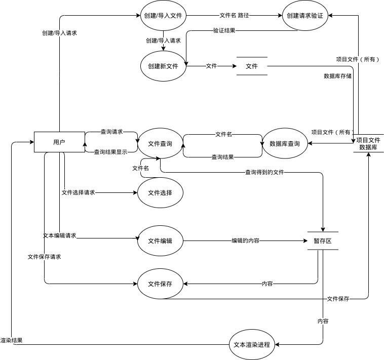
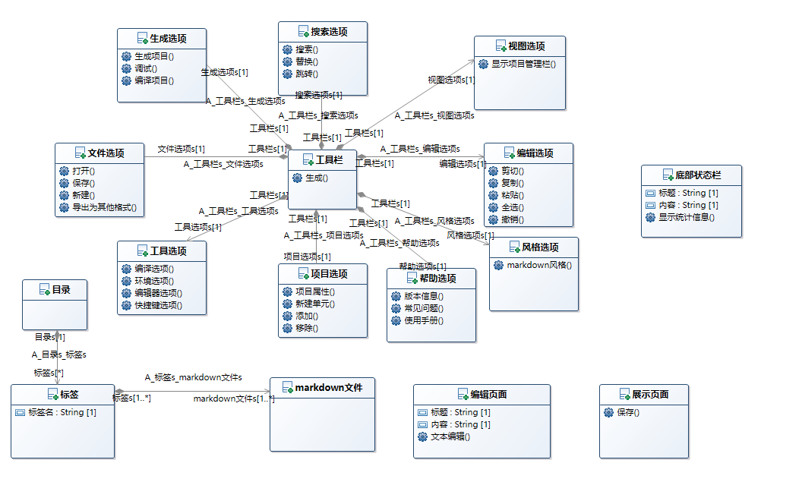

# 系统分析文档 

### 结构化分析方法

将事物抽象成类是人类的常用思维，但着并不意味着任何事物都必须以面向对象的思维来考察。

结构化分析包括将系统概念转换为用数据及控制的来表示，也就是转换为数据流程图。其以数据在不同模块中流动的观点来看待一个系统，系统的功能可以用转换数据流的程序来表示。结构化分析善用了功能拆解（或由上到下设计）的信息隐藏特性，因此可以关注在重要的细节，而不会被无关的细节干扰。

此处我们使用结构化方法来对编辑器进行分析建模，这是因为对于一个编辑器来说，我们可以将其分成不同的部件来划分功能，但抽象成类却并非十足必要。

## 数据流图

从最简化的顶层抽象来看，**用户**作为数据源/数据潭是系统的边界，而**代码编辑器系统**正是一个总和的数据加工函数。用户同系统进行各种交互，这也是最为基础的用况模型。显然这个`数据加工`是综合待分解的。

考虑代码编辑器的几大基本刚性需求：文本编辑、目录维护、文本编码、文本高亮。我们可以进一步进行分解：

* 目录维护:
  涉及代码目录（工作区项目）数据库、文件创建删除、文件查询、文件选择等。
* 文本编码
  编码属于文本属性，也即是文本编辑的特殊。
* 文本编辑
  编辑内容的暂存涉及到暂存区的处理
* 文本高亮
  语法高亮涉及高亮渲染模块，而最终的代码高亮即时显示，则涉及实时渲染进程。

因此，用户同代码编辑器的交互可以归纳为以下几种：

* 创建/导入文件功能（文件的删除同理）
  涉及用户提交申请、系统验证、最终的创建操作**三部分**
* 文件查询功能——辅助于项目目录显示，同项目数据库交互获得信息
* 文件选择——通过查询数据库，选择显示某个文件
* 文本编辑——各色编辑功能如普通输入、剪切等；以及文件暂存区功能。
* 文件保存——将文件暂存区内容保存至文件中
* 文本渲染——代码编辑器实时的渲染进程，配合高亮模块进行文本显示（实时反馈，后台执行）

#### 数据流图如下：

## ER图

由于代码编辑器中很难抽象出对象，并不适合用面向对象的方法进行建模。因此，在需求文档中本小组就根据常见代码编辑器的页面分布，将编辑器划分为四大区域，分别为工具栏、编辑页面、目录和底部状态栏。由于这四块区域本身就是根据前端页面进行划分的，因此将其定义为实体其实有些勉强，但根据所学知识，又难以找到更好的方法来表述编辑器，因此还是用E-R图进行描述。

该分析模型主要基于软件的操作界面的不同区域进行类的划分，并将每个区域可能存在的交互作为该类的函数。工具栏由各个选项聚合而成，文件选项中主要有打开、保存、新建和导出等操作，编辑选项中主要有复制、粘贴、剪切、全选、撤销等操作，搜索选项中主要有搜索、替换、跳转等操作，还有生成选项、视图选项、项目选项、工具选项、帮助选项和风格选项等多种选项，构成了上方的工具栏。

文件目录可以看做是标签的聚合，标签又对应着markdown文件。编辑页面可以看做单独的一个实体，其中主要有文本编辑等功能。展示页面也可以看做一个单独的实体，主要是显示内容，并进行保存操作。同样，底部状态栏也可以看做是独立的实体，其中显示统计的信息。

#### ER图如下：

