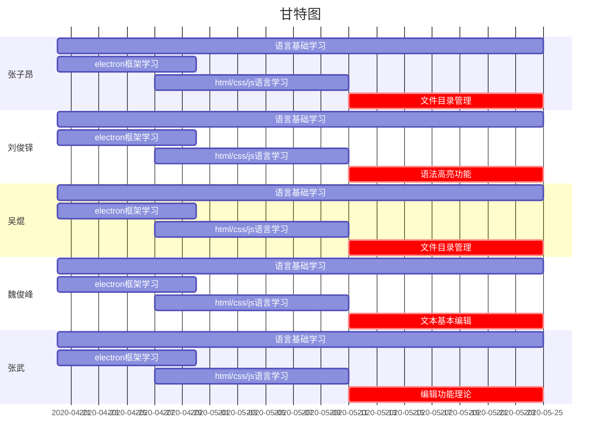
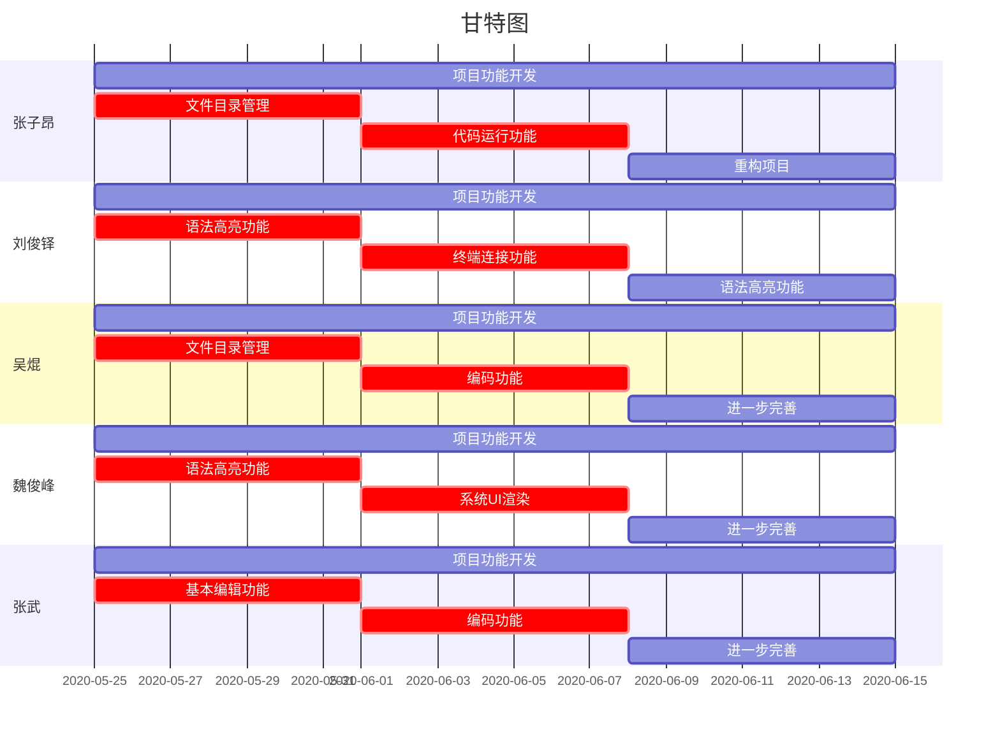
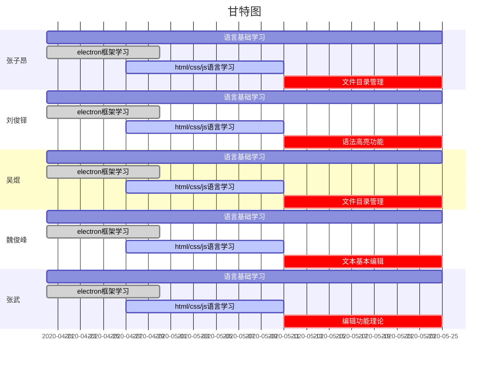
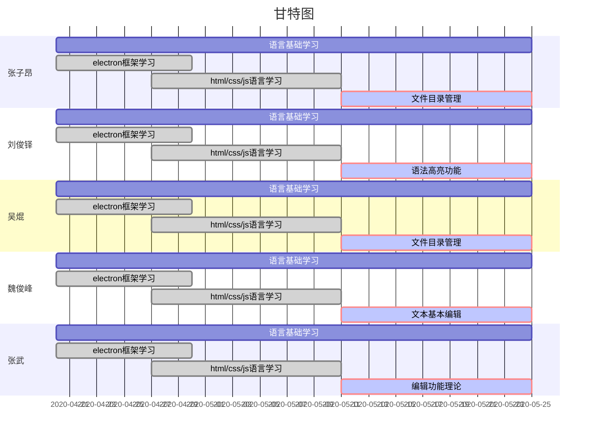
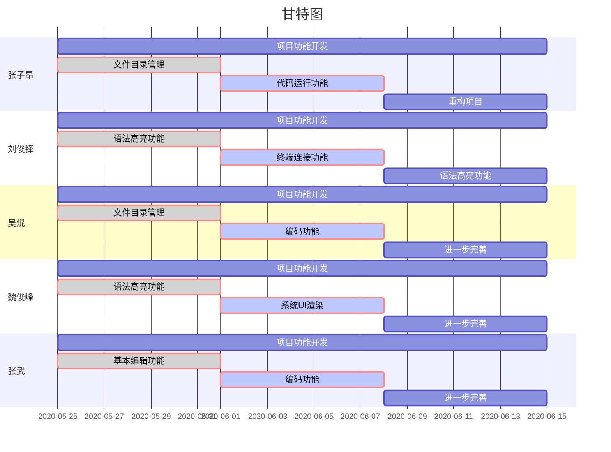

项目分工及开发计划

以上是基本的调研结果，分工以及开发计划以甘特图的形式呈现。**因为并非最终版本，所以时间线以及内容上比较粗粒度。**由于项目需要花费大量时间成本进行学习，故大体上将开发计划分为两个阶段，第一个阶段为8-13周**语言基础学习**，第二个阶段为14-16周的**项目开发实践**。

此计划更新**迭代周期**预计为两周一次。

9-13周

14-16周

此后将每两周更新大致任务完成情况及进一步开发计划安排

第11周

9-10周在完成项目分工及开发计划、系统原型和需求文档基础上，进行了对electron框架的学习，以及electron框架的初步搭建。

第13周

11-12周在完成系统分析文档、系统设计文档基础上，在菜鸟教程、w3school等平台进行了electron框架下HTML、CSS、JS语言的学习，以及跟项目相关资料的搜集和整理。

第15周

9-13周大致完成了语言基础的学习，14-16将展开项目功能的实际开发。第十四周小组成员在各自任务上进行了初步探索，但严格意义上并没有完全实现任务，故在接下来两周任务量较大。

