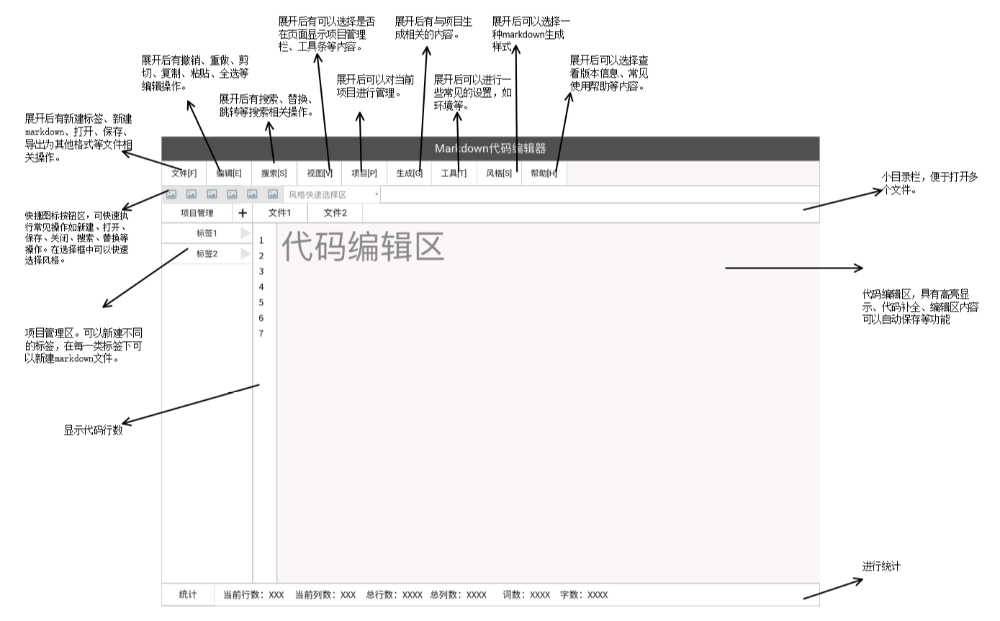

<h1 align="center">
    
</h1>
<h3 align="center">跨平台代码编辑器</h3>

  <h4 align="center">cross_platform_code_editor</h4
## About The Project

#### Navigator

[软件开发计划[Updated]](./MaterialFolder/Main/PLAN.md)

[需求文档](./MaterialFolder/Main/SRS.md)

[系统分析文档](./MaterialFolder/Main/SystemAnalyseDocument.md)

[系统设计文档](./MaterialFolder/Main/Design.md)

[用户手册](./MaterialFolder/Main/用户手册.docx)

[系统实现](./MaterialFolder/Main/第八周+系统实现.doc)

[软件测试文档](./MaterialFolder/Main/软件测试文档.docx)

### System prototype

`V0.1`

-   

